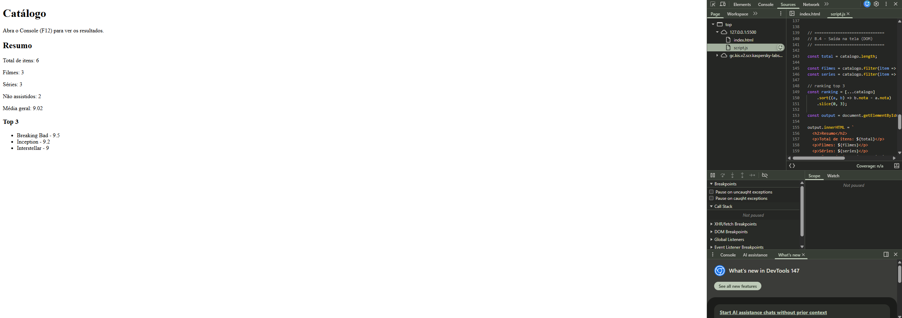
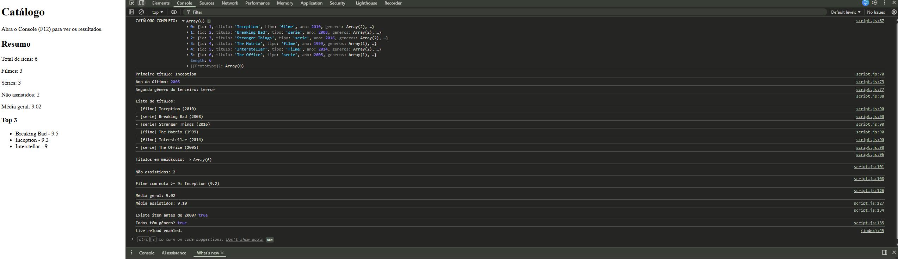

 Atividade Prática - Objetos e Arrays (JSON)

Nome: Francisco Ronaldo Vasconcelos Araujo
Matrícula: 1659978  

Descrição
Projeto de manipulação de objetos e arrays em JavaScript utilizando JSON e iterators.

 Funcionalidades
- Listagem de títulos
- Cálculo de médias
- Filtros e buscas
- Verificações com some e every
- Exibição no console e na página

 Prints

- Console com listagem
- Médias
- Checagens
- Página com resumo

teste